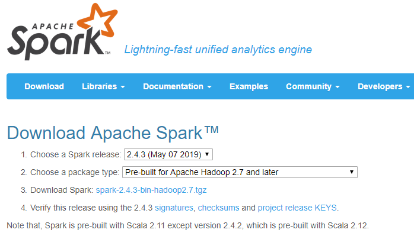
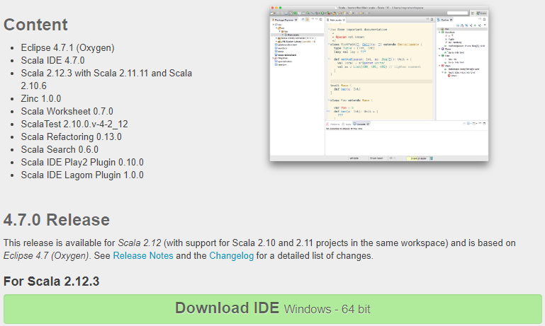

# Setup

## 1.1. Installing Spark+Hadoop on Linux

1\. Go to [Apache Spark Download page](http://spark.apache.org/downloads.html). Choose the Spark release (2.4.3), and the package type "Pre-built for Hadoop 2.7 and later". Click on the link "Download Spark" to get the `tgz` package of the 2.4.3 Spark release. On Aug 2019 this file was `spark-2.4.3-bin-hadoop2.7.tgz` so we will be using that in the rest of these guidelines but feel free to adapt to your version.

```
wget https://archive.apache.org/dist/spark/spark-2.4.3/spark-2.4.3-bin-hadoop2.7.tgz
```

> 

2\. Uncompress that file into `/usr/local` by typing:

```
sudo tar xvzf spark-2.4.3-bin-hadoop2.7.tgz -C /usr/local/
```

3\. Create a shorter symlink of the directory that was just created using:

```
sudo ln -s /usr/local/spark-2.4.3-bin-hadoop2.7 /usr/local/spark
```

4\. Go to [Apache Hadoop Download page](http://hadoop.apache.org/releases.html#Download). On the table above, click on the 2.7.3 version (3.1.2 as of Aug 2019). Click as to download the *binary* version `tar.gz` archive, choose a mirror and download the file unto your computer.

5\. Uncompress that file into `/usr/local` by typing:

```
sudo tar xvzf /path_to_file/hadoop-2.7.3.tar.gz -C /usr/local/
```

6\. Create a shorter symlink of this directory using:

```
sudo ln -s /usr/local/hadoop-2.7.3 /usr/local/hadoop
```

## 1.2. Installation of Spark+Hadoop

We strongly recommend you update your installation to the must recent version of Spark. As of Aug 2019 we used Spark 2.4.3 and Hadoop 2.7.3.

If you want to use another version there, all you have to do is to locate your installation directories for Spark and Hadoop, and use that in the next section 2.1 for setting up your environment.


# 2. Setting up your environment

## 2.1. Environment variables

To run Spark scripts you have to properly setup your shell environment: setting up environment variables, verifying your AWS credentials, etc.

1\. Edit your `~/.bash_profile` to add/edit the following lines depending on your configuration. This addition will setup your environment variables `SPARK_HOME` and `HADOOP_HOME` to point out to the directories used to install Spark and Hadoop.

**For the Linux installation described above**, copy/paste the following lines into your `~/.bash_profile`:
```bash
export SPARK_HOME=/usr/local/spark
export PYTHONPATH=$SPARK_HOME/python:$PYTHONPATH

export HADOOP_HOME=/usr/local/hadoop
export LD_LIBRARY_PATH=$HADOOP_HOME/lib/native/:$LD_LIBRARY_PATH
```

**Note**: After any modification to your `.bash_profile`, for your terminal to take these changes into account, you need to run `source ~/.bash_profile` from the command line. They will be automatically taken into account next time you open a new terminal.

## 2.2. Python environment

1\. Back to the command line, install py4j using `pip install py4j`.

2\. To check if everything's ok, start an `ipython` console and type `import pyspark`. This will do nothing in practice, that's ok: **if it did not throw any error, then you are good to go.**


# 3. How to run Spark python scripts

## 3.1. How to run Spark/Python from command line with via `spark-submit`

Instead of using jupyter notebook, if you want to run your python script (using Spark) from the command line, you will need to use an executable from the Spark suite called `spark-submit`. Again, this executable requires some options that we propose to put into a script to use whenever you need to launch a Spark-based python script.


1\. Create a script you would call `localsparksubmit.sh`, put it somewhere handy. Copy/paste the following content in this file:

```bash
#!/bin/bash
${SPARK_HOME}/bin/spark-submit \
--master local[4] \
--executor-memory 1G \
--driver-memory 1G \
--conf spark.sql.warehouse.dir="file:///tmp/spark-warehouse" \
--packages com.databricks:spark-csv_2.11:1.5.0 \
--packages com.amazonaws:aws-java-sdk-pom:1.10.34 \
--packages org.apache.hadoop:hadoop-aws:2.8.0 \
$@
```

See the previous section 2.1 for an explanation of these values. The final line here `$@` means that whatever you gave as an argument to this `localsparksubmit.sh` script will be used as a last argument in this command.

2\. Whenever you want to run your script (called for instance `script.py`), you would do it by typing `localsparksubmit.sh script.py` from the command line. Make sure you put `localsparksubmit.sh` somewhere under your `$PATH`, or in a directory of your linking.

**Note**: You can adapt these parameters to your own setup. See Spark page on [Submitting applications](http://spark.apache.org/docs/latest/submitting-applications.html) to tune these parameters.

# 4. Testing your installation

1\. Open a new jupyter notebook (from the `jupyspark.sh` script provided above) and paste the following code:

```python
import pyspark as ps
import random

spark = ps.sql.SparkSession.builder \
        .appName("rdd test") \
        .getOrCreate()

random.seed(1)

def sample(p):
    x, y = random.random(), random.random()
    return 1 if x*x + y*y < 1 else 0

count = spark.sparkContext.parallelize(range(0, 10000000)).map(sample) \
             .reduce(lambda a, b: a + b)

print("Pi is (very) roughly {}".format(4.0 * count / 10000000))
```

It should output the following result :

```
Pi is (very) roughly 3.141317
```

2\. Create a python script called `testspark.py` and paste the same lines above in it. Run this script from the command line using `localsparksubmit.sh testspark.py`. It should output the same result as above.

# 5. Scala IDE
The aim of Scala IDE is to provide a support for Scala development equivalent to the support provided by Eclipse for Java development.

1\. Go to [Scala IDE Download page](http://http://scala-ide.org/download/sdk.html). Choose the release (4.7.0). Click on the link "Download IDE" to get the `tgz.gz` package of the latest IDE release. On Aug 2019 this file was `scala-SDK-4.7.0-vfinal-2.12-linux.gtk.x86_64.tar.gz` so we will be using that in the rest of these guidelines but feel free to adapt to your version.

```
wget downloads.typesafe.com/scalaide-pack/4.7.0-vfinal-oxygen-212-20170929/scala-SDK-4.7.0-vfinal-2.12-linux.gtk.x86_64.tar.gz
```

2\. Uncompress that file into `/usr/local` by typing:

```
sudo tar xvzf scala-SDK-4.7.0-vfinal-2.12-linux.gtk.x86_64.tar.gz -C /usr/local/
```

3\. To run Scala IDE

```
/usr/local/eclipse/eclipse
```

> 

